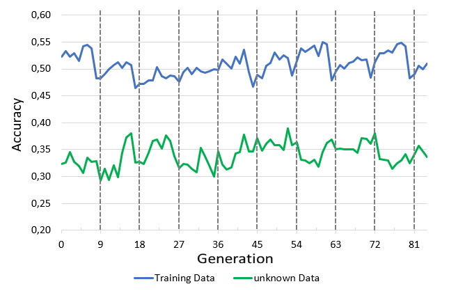
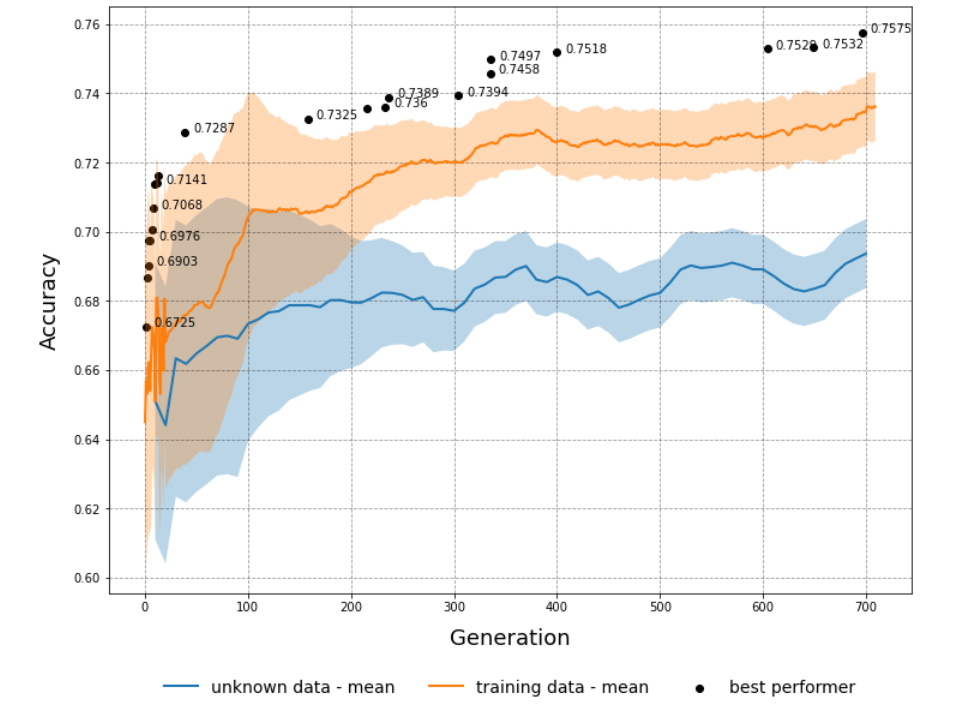
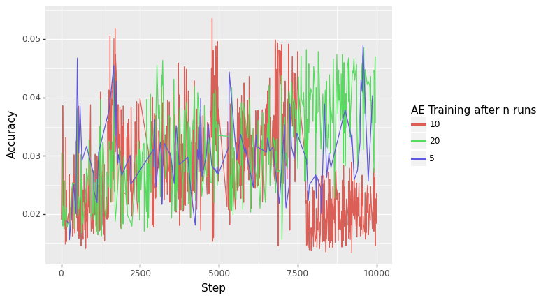
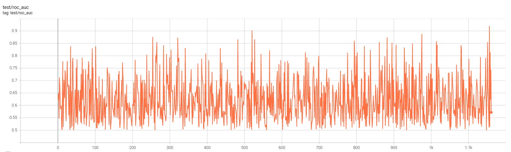

# Neuro - Evolution Experiments

This project is about exploring the capabilities of neuro-evolution for training deep neural networks for 
few-shot learning tasks.

## Table of contents
* [What is Neuro - Evolution?](#What-is-Neuro-Evolution?)
* [Content of the Repository](#Content-of-the-Repository)
* [Technologies](#Technologies)
* [Dependencies](#Dependencies)
* [Launch](#Launch)
* [Experiments](#Experiments)
  * [Experiment 1](#Experiment-1)
  * [Experiment 2](#Experiment-2)
  * [Experiment 3: Auto-Encoder](#Experiment-3-Auto-Encoder)
  * [Experiment 4: MAML](#Experiment-4-MAML)

## What is Neuro Evolution?

Neuro-evolution refers to a machine learning technique where artificial neural networks are evolved using genetic algorithms. In this project, we explore the use of neuro-evolution as an alternative to traditional gradient descent-based training. The goal is to create a large network that can perform few-shot learning, which is the ability to quickly learn new tasks with limited data.

The process of neuro-evolution involves generating small variations of a neural network, which we call "offspring," and evaluating their performance using a fitness function. The fittest networks are then combined, or "fused," to form a new generation of networks. This process is repeated until the desired level of performance is achieved.

Neuro-evolution offers several advantages over gradient descent-based training, including the ability to handle metrics that are not differentiable and the ability to train in parallel. These advantages are particularly useful in reinforcement learning applications.

Please find more information here:
Paper: https://ieeexplore.ieee.org/document/9383028

## Content of the Repository

In our experiments, we use a few-shot learning task, such as MNIST classification, as the evaluation for the fitness function. The accuracy of the few-shot learner is used as the fitness metric, and the network with the highest accuracy is selected as the best network. The weighting of the fusion is based on this fitness function.

The project includes several experiments, including MNIST classification, a reconstruction task using an autoencoder, and a comparison with Model-Agnostic Meta-Learning (MAML). The results of these experiments are presented in visual format.
all advantages are very good in reinforcement training. 

## Technologies

Following technologies are used:
- Python
- Jax and Haiku
- Tensorflow
- Pytorch and Torchvision
- Sklearn and Numpy

## Dependencies
- python = 3.10
- jax = 0.3.25
- matplotlib = 3.6.2
- numpy = 1.23.5
- torch = 1.13.1
- scikit-learn = 1.1.1
- dm-haiku = 0.0.8
- tensorflow = 2.10.0

## Launch

After install of all packages just launch the experiment.

## Experiments

The project includes 4 experiments:
### Experiment 1

This experiment is described in the "Experiment 1.ipynb" file and uses the MNIST dataset as the smaller network for training. The fitness function is accuracy. The smaller network is trained on 5 categories that change after 10 training iterations (called meta-epochs).
### Experiment 2

This experiment, described in the "Experiment 2.py" file, is similar to Experiment 1, but the smaller network is trained on a random sample of categories instead of consecutively changing categories.
### Experiment 3: Auto-Encoder

This experiment, described in the "Experiment 3.py" file, trains a decoder to test the quality of the representation learned by the larger network. The weighting of the evolutionary network is based on the l2 loss function of the decoder, specially the l2 loss between reconstruction and original. 

### Experiment 4: MAML

This experiment, described in the "Experiment 4 maml/train_maml_better_acc.py" file, is a comparison between MAML and other few-shot learners without using neural evolution.
Results

The project includes several plots of the accuracy of the few-shot learner in each experiment, including:

